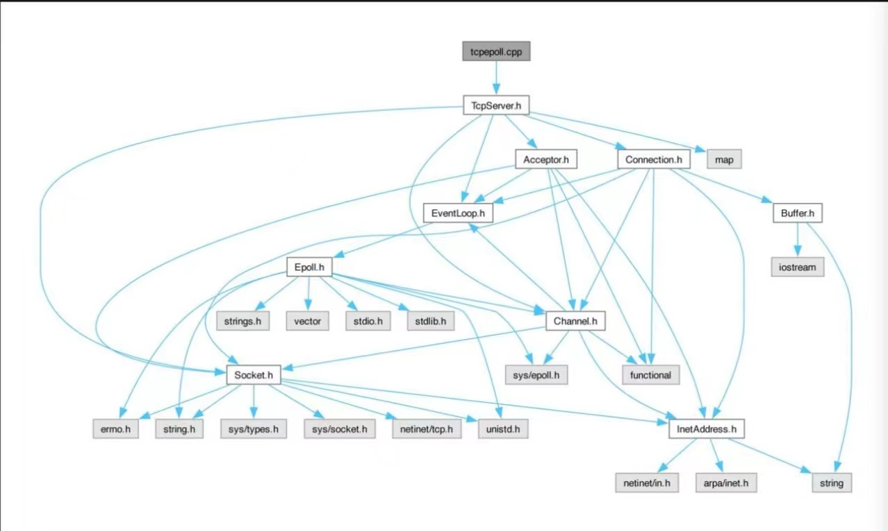
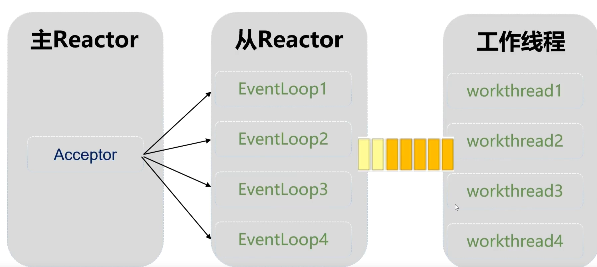

# Reactor Web Server
## 此项目对一些网络函数进行了封装

### InetAddress: 地址协议类

封装了 sockaddr_in 结构体, 设置两个构造函数, 一个为了监听的fd, 另一个为了客户端连上来的fd


### Socket类: 封装网络函数(fd) 

封装了socket(), bind() listen() accept()等网络函数


### Epoll类:封装了epoll的三个函数
    epoll_create() : Epoll::Epoll()
    epoll_ctl() : updatechannel(), removechannel()
    epoll_wait() : vector<Channel*> Epoll::loop() 返回事件发生的vector


封装了地址协议(Socket,Epoll), 隐藏了底层语言的实现细节, 精简主程序, 增加了可读性
---------------------------------------------------------------------------


### Channel类: fd的保镖, 也相当于fd的管家 一对一服务
```c++
struct epoll_event
{
    uint32_t events; //指定事件
    epoll_data_t data; //携带的数据
};

union epoll_data
{
    void *ptr;
    int fd;
    uint32_t u32; 
    uint64_t u64;
}

```
epoll_data中的void *ptr比fd携带的数据多, Channel类的作用类似于fd的保镖, 用回调函数的形式像Channel对象注册各类事件的处理函数


### EventLoop类:  封装了Epoll类对象和事件循环

### TcpServer类: 封装了EventLoop对象的类, 一个TcpServer可以有多个事件循环

### Acceptor类: 由服务器端监听的Channel封装而成


Channel类封装了监听fd和客户端连接的fd, 监听的fd与客户端连接的fd的功能是不同的, 监听的fd与客户端连接的fd的声明周期也不同

### Connection类: 封装服务器端用于通信的Channel ,由客户端连接的Channel封装而成,

Channel类是Connection类的底层类, Connection类是TcpServer类的底层类
建立Tcp连接和释放Tcp连接都需要两次回调函数

Connection对象在TcpServer::newconnection()中创建, 被添加到subloops从循环中, 创建好之后分配给从事件循环(IO线程),如果收到了客户端的请求报文, Connection对象还会被作为参数传递给工作线程, 在工作线程中执行业务的处理函数. 


如果客户端连接断开, 释放Connection对象TcpServer::closeconnection(),这个函数运行在IO线程中, 如果在处理的过程中connection连接被释放了, 指向Connection对象的指针就变成了野指针 ==>> 使用智能指针, 智能指针可以在合适的时机自动释放资源

使用智能指针管理Connection对象之后, 需要处理在Connection对象析构之后剩下的属于它的Channel对象, 所以添加了两个函数Channel::disableall()和Channel::remove(), 并在Epoll类中用两个同名的函数调用这两个函数


### Buffer类: 封装了一个用户缓冲区，以及向这个缓冲区写数据读数据等一系列控制方法,为了读写配合，缓冲区内部调整以及动态扩容

Tcp发送缓冲区的尺寸在默认情况下的全局设置是16384字节，即16k。

Buffer类:
在非阻塞的网络服务程序中, 事件循环不会阻塞在recv和send中, 如果数据接收不完整, 或者发送缓冲区已填满, 都不能等待, 所以Buffer是必须的
在Reactor模型中, 每个Connection对象拥有InputBuffer和SendBuffer


TcpConnection必须要有input buffer, TCP是一个无边界的字节流协议, 接收方必须要处理"接收的数据尚不构成一条完整的消息" 和 "一次接收到两条消息的数据" 等情况


长度为n字节的消息分块到达的可能性有 2^n-1 种


网络库在处理 "socket" 可读事件的时候, 必须一次性把socket里的数据读完(从操作系统buffer搬到应用层buffer), 否则会反复触发POLLIN事件, 造成busy-loop.那么网络库必然要应对"数据不完成的情况", 收到的数据先放到input buffer里, 等构成一条完整的消息再通知程序的业务逻辑. 所以在TCP网络编程中, 网络库必须要给每个TCP connection配置input buffer


TcpConnection必须要有output buffer, 考虑一个常见场景: 程序想通过TCP连接发送100KB的数据, 但是在write()调用中, 操作系统只接受了80KB(受advertised window控制)


你肯定不想在原地等待, 因为不知道会等多久(取决于对方什么时候接收数据, 然后滑动TCP窗口). [滑动窗口 : 发送方根据收到的确认信息动态地调整发送数据的量,以实现更高效的数据传输],
程序应该尽快交出控制权, 返回event loop. 在这种情况下, 剩余的20KB数据怎么办?
对于应用程序而言, 它只管生成数据,它不应该关心到底数据是一次性发送还是分成几次发送, 这些应该由网络库来操心, 程序只要调用TcpConnection::send()就行了, 网络库会负责到底.
网络库会负责到底, 网络库应该接管这剩余的20KB的数据, 把它保存在该TCP connection的output buffer里, 然后注册POLLOUT事件, 一旦socket变得可写就立刻发送数据.
当然, 这第二次write()也不一定能完全写入20KB, 如果还有剩余, 网络库应该继续关注POLLOUT事件; 如果写完了20KB,网络库应该停止关注POLLOUT, 以免造成busyloop

_____


Acceptor, Buffer, Channel, Connection, Epoll, EventLoop, InetAddress, Socket, TcpServer(最上层的类)都是底层类

### TCP的粘包和分包
1. 粘包: tcp接收到数据之后, 有序放在接收缓冲区中, 数据之间不存在分隔符的说法, 如果接收方没有及时的从缓冲区中取走数据, 看上去就像粘在了一起.
2. 分包: tcp报文的大小缺省是1460字节, 如果发送缓冲区的数据超过1460字节, tcp将拆分成多个包发送, 如果接收方及时的从接收缓冲区中取走了数据, 看上去就像是接收到了多个报文


-> 解决方法 : 
1) 采用固定长度的报文.
2) 在报文前面加上报文长度. 报文头部(4字节的整数) + 报文内容
3) 报文之间用分隔符. http协议 \r\n\r\n

### 创建ThreadPool类, 线程池
```
//ThreadPool类构造函数
ThreadPool::ThreadPool(size_t threadnum, const std::string &threadtype):stop_(false),  threadtype_(threadtype)
{
    // 启动threadnum个线程，每个线程将阻塞在条件变量上。
	for (size_t ii = 0; ii < threadnum; ii++)
    {
        // 用lambda函创建线程。
        /* [this]捕获当前类中的this指针, 让lambda表达式拥有和当前类成员函数同样的访问权限  */
		threads_.emplace_back([this] 
        { //lambda函数内部
            printf("In ThreadPool::ThreadPool, create %s thread(%ld).\n", threadtype_.c_str(), syscall(SYS_gettid));     // 显示线程ID 和 线程类型

			while (stop_==false)
			{
				std::function<void()> task;       //创建一个函数对象 ,用于存放出队的元素。

				{   // 锁作用域的开始。  
					std::unique_lock<std::mutex> lock(this->mutex_);

					this->condition_.wait(lock, [this] 
                    { 
                        return ((this->stop_==true) || (this->taskqueue_.empty()==false)); // 非空或者 要求停止的时候返回
                    });

					if ((this->stop_==true)&&(this->taskqueue_.empty()==true)) return;//如果满足这两个条件, 函数返回, lambda函数退出

					task = std::move(this->taskqueue_.front());
					this->taskqueue_.pop();
				}   // 锁作用域的结束。  


                printf("ThreadPool::ThreadPool %s thread %ld execute task.\n",threadtype_.c_str(), syscall(SYS_gettid));
				task();  // 执行任务。
			}
		});
    }
}
```
互斥锁不是锁定资源本身，而是通过控制对资源的访问来保护资源。当一个线程持有互斥锁时，其他线程不能同时持有该互斥锁，从而确保了在同一时间只有一个线程可以访问共享资源，保证了数据的一致性和完整性。

ThreadPool::ThreadPool(size_t threadnum, const std::string &threadtype):stop_(false), threadtype_(threadtype): 这是构造函数的声明。它接受两个参数，一个是线程数量 threadnum，另一个是线程类型 threadtype。同时，它初始化了两个成员变量 stop_ 和 threadtype_，其中 stop_ 初始化为 false，表示线程池不需要停止，threadtype_ 则使用传入的参数 threadtype 进行初始化。

for (size_t ii = 0; ii < threadnum; ii++): 这是一个循环语句，用来创建指定数量的线程。ii 从 0 开始，每次循环递增，直到 ii 的值小于 threadnum。

threads_.emplace_back([this]: 这行代码创建了一个新的线程，并将其添加到 threads_ 容器中。emplace_back 函数用于在容器的尾部添加一个元素。在这里，使用了 lambda 表达式来定义线程的行为，同时使用 [this] 捕获当前对象的指针，以便在 lambda 表达式中可以访问到当前对象的成员变量和方法。

printf("In ThreadPool::ThreadPool, create %s thread(%ld).\n", threadtype_.c_str(), syscall(SYS_gettid));: 这行代码用于输出信息，显示正在创建的线程的类型和线程 ID。threadtype_.c_str() 用于获取线程类型的 C 字符串表示，syscall(SYS_gettid) 获取当前线程的 ID。

while (stop_==false): 这是一个 while 循环，它会不断地检查 stop_ 标志，只要 stop_ 是 false，就会执行循环体中的代码。

std::function<void()> task;: 这行代码定义了一个 std::function 对象 task，用于存放待执行的任务。这是一个可调用对象的封装器，可以用来保存函数、函数对象、lambda 表达式等。

{: 用于限定 lock 的作用范围。

std::unique_lock<std::mutex> lock(this->mutex_);: 这行代码创建了一个 std::unique_lock 对象 lock，并使用 mutex_ 对象进行锁定。这样可以确保在执行任务队列操作时是线程安全的。

this->condition_.wait(lock, [this]: 这行代码是条件变量的等待操作。condition_.wait() 会将当前线程置于等待状态，并释放锁。等待的条件是一个 lambda 表达式，它检查了两个条件：stop_ 是否为 true，以及任务队列是否为空。只有当这两个条件之一成立时，线程才会被唤醒。

if ((this->stop_==true)&&(this->taskqueue_.empty()==true)) return;: 如果线程被唤醒后，检查 stop_ 是否为 true，以及任务队列是否为空。如果满足这两个条件，则说明线程池已经被要求停止，并且没有剩余的任务需要执行，于是线程退出。

task = std::move(this->taskqueue_.front());: 这行代码从任务队列中取出一个任务，并将其移动到 task 对象中。通过 std::move 将任务从队列中取出，避免了拷贝构造函数的调用，提高了效率。

this->taskqueue_.pop();: 这行代码从任务队列中移除已经取出的任务。
#### 当没有互斥锁的保护时，多个线程可能会在同一时间内调用 wait() 进入等待状态，这可能会导致竞态条件的发生。

考虑这样一个场景：有一个生产者线程和多个消费者线程，它们共享一个任务队列（比如一个队列或者一个缓冲区）。生产者线程负责往任务队列中添加任务，而消费者线程负责从任务队列中取出任务并执行。

假设我们使用条件变量 std::condition_variable 和一个互斥锁来实现生产者-消费者模式。生产者在往任务队列中添加任务后会通知等待的消费者线程，而消费者在任务队列为空时会进入等待状态。

现在考虑以下情况：多个消费者线程都在等待队列不为空的条件满足时被唤醒，但是当它们检查队列时发现队列仍然为空。如果没有互斥锁的保护，那么这些消费者线程可能会同时调用 wait() 进入等待状态，这样就会出现竞态条件，导致程序行为不确定。

举个例子，假设有两个消费者线程 C1 和 C2，它们都在等待队列不为空的条件满足时被唤醒。如果没有互斥锁的保护，那么它们可能同时检查队列为空，然后同时调用 wait() 进入等待状态。此时，如果生产者线程添加了一个任务并通知了等待的消费者线程，由于条件变量的唤醒是不确定的，可能只有一个消费者线程能够被唤醒，而另一个线程则继续等待。这样就导致了竞态条件的发生，程序的行为将不确定。

一个消费者线程能够被唤醒，而另一个线程则继续等待会导致一些问题


1. 效率问题： 如果有多个线程都在等待相同的条件，但只有一个线程被唤醒，其他线程仍然在等待状态，这可能会导致资源的浪费。因为这些线程没有被唤醒，它们会继续占用系统的资源（如内存、CPU 时间），但实际上它们并没有做任何有意义的工作。

2. 公平性问题： 如果只有一个消费者线程被唤醒，而其他线程一直处于等待状态，这可能会导致线程间的公平性问题。即使其他线程可能也满足了等待条件，但它们仍然被阻塞，无法及时执行。这可能导致某些线程长时间处于等待状态，而其他线程则较少地被唤醒，从而降低了程序的公平性。

3. 死锁问题： 如果某个线程长时间处于等待状态，而其他线程都无法唤醒它，可能会导致死锁问题。如果线程间的依赖关系复杂，可能会出现循环等待的情况，导致所有线程都无法继续执行，从而导致程序无法正常工作。


### 为什么要增加工作线程
1. Acceptor运行在主Reactor(主进程)中, Connection运行在从Reactor(进程池)中
2. 一个从Reactor负责多个Connection, 每个Connection的工作内容包括IO和计算(处理客户端要求). IO不会阻塞事件循环, 但是, 计算可能会阻塞事件循环. 如果计算阻塞了事件循环, 那么在同一Reactor中的全部Connection将会被阻塞
 -> 解决方式 : 分配器Acceptor把Connection分配给从Reactor, 从Reactor运行在线程池中, 有很多个, 此时IO和计算都在从Reactor中, 此时可以把计算的过程分离出来, 把计算的工作交给工作线程(workthread), 让工作线程去处理业务, 从Reactor只负责IO, 以免从Reactor阻塞在计算上.


 ### 为什么使用移动语义
使用移动语义而不是拷贝的主要原因是提高性能和避免不必要的资源开销。

当对象被传递给函数或从函数返回时，如果使用拷贝语义，会导致对象的内容被复制到新的内存空间中，这涉及到内存的分配和数据的复制，可能会带来性能上的开销。

而使用移动语义，可以避免这种性能开销。移动语义允许在不复制数据的情况下将对象的资源所有权从一个对象转移到另一个对象。具体来说，当对象被移动构造或移动赋值时，资源的指针会被转移，而不是进行数据的复制。这样可以节省内存分配和数据复制的开销，提高程序的性能。

另外，对于一些资源管理类，比如智能指针、文件句柄等，拷贝语义可能是不合适的，因为这些资源应该是唯一的，不应该被多个对象共享。使用移动语义可以确保资源的唯一性，避免资源被意外释放或多次释放的问题。

因此，使用移动语义可以提高性能，避免不必要的资源开销，并确保资源的唯一性和正确的管理。

### 为什么要清理空闲的Connection对象
1. 空闲的connection对象是指长事件没有进行通讯的tcp连接
2. 空闲的connection对象会占用资源, 需要定期清理
3. 避免攻击, 攻击者可以利用Connection对象不释放的特点进行大量tcp连接, 占用服务器端资源

### 多线程资源管理Connection对象 -> shared_ptr
 共享指针(shared_ptr), 共享指针会记录有多少个共享指针指向同一个物体, 当这个物体数量将为0的时候, 程序就会自动释放这个物体, 省去程序员手动delete的环节
 PS: 如果一块资源同时有裸指针和共享指针指向它的时候, 那么当所有的共享指针都被摧毁, 但是裸指针仍然存在的时候, 这个裸指针底下的子隐患仍然会被释放, 此时再用裸指针去访问那块资源就变成了未定义的行为,会导致很严重的后果.


 ### 异步唤醒事件循环

 通知线程的方法: 条件变量, 信号量, 管道, eventfd

 事件循环阻塞在epoll_wait()函数, 条件变量, 信号量有自己的等待函数, 不适合用于通知事件循环

 socket,管道, eventfd都是fd, 可以加入epoll, 如果要通知事件循环, 往socket, 管道, eventfd中写入数据即可 =>> epoll会检测到有数据可以读,会触发读事件

int efd = eventfd(2 : 初始值 , 0 : 标志位(可以操作eventfd的行为)); //初始值

read(): 读操作就是将counter值置0，如果是semophore(在标志位设置)就减1。

write(): 设置counter的值 , eventfd会累加write()的值


无名管道int pipefd[2] 用于多进程间通信, 有两个fd,表示管道的两端, fd[0]用于读, fd[1]用于写, 关闭的时候需要关闭读fd和写fd

### 项目结构
 基础类 
 Socket : fd_ ,  ip_ , port_ 
 Channel : fd_ , EventLoop*, 通过回调函数控制读写事件的执行, 处理读写epoll_wait()返回之后, 控制事件的执行
 TcpServer 的构造函数创建 Acceptor实例, setnewconnection (TcpServer::newconnection),   在newconnection中accept(), 创建connection, 设置conn实例的回调函数, 将新创建的conn实例加入到 TcpServer::map中,
 Acceptor 创建的时候 执行socket(), bind(), listne(); 

 Connection::onmessage() 读事件完成 -> TcpServer:: onmessage(), 准备回送的信息, 添加报文头部 -> Connection::send(), 添加数据到outputbuffer_, 注册写事件, 把注册后的event_添加到epoll的红黑树上
 Connection::writecallback()


使用outputbuffer_缓冲区发送数据, 
 server.Start() -> tcpserver_.start_run() -> mainloop_->run(); EventLoop::run() // 运行事件循环, std::vector<Channel*> channels = ep_->loop(), Epoll::loop()//把有时间发生的fd添加到vector<Channel*>; // 存放epoll_wait() 返回事件, // 遍历epoll返回的数组evs, ch->handleevent();遍历事件 -> Channel::handleevent() -> Connection::writecallback()"只有Connection有发送和读取缓冲区" -> ::send(), 然后清空缓冲区,注销写事件,clientchannel_->disabelwriting();


### 程序主体结构
 主事件循环负责客户的连接, 然后把客户端的连接分配给从事件循环, 从事件循环运行在线程池中, 称为IO线程, IO线程接收到客户端的请求报文之后, 把它交给工作线程去计算, 工作线程计算完之后, 把响应报文直接发送给客户端
 
### 异步唤醒事件循环
 目标 : 在工作线程中把发送数据的操作通过队列交给事件循环, 然后唤醒事件循环, 让事件循环执行发送的任务


### 指针的使用

1. 如果资源的生命周期难以确定,则使用shared_ptr来管理

2. 类自己所拥有的资源用unique_ptr来管理, 在类被销毁的时候, 将会自动释放资源

3. 对于不属于自己,但会使用的资源,采用unique_ptr& 或 shared_ptr来管理会很麻烦, 不易阅读, 还可能会对新手带来一系列问题, 依旧采用裸指针来管理

### mutex不可以拷贝, 可以将mutex改为引用传递参数
### std::bind( , , ), bind函数
第一个函数是成员函数的地址, 第二个参数是对象的地址(需要普通指针)


### 代码现在的未解决的bug Ubuntu 2004
在EventLoop()函数中: 在map conns_已经为空的情况下, 执行else{} 中的for循环的时候还是会进入, 最终导致段错误
```cpp
    if(mainloop_){
        // printf("主事件循环的闹钟时间到了。\n");
    }
    else
    {
        printf("EventLoop::handletimer() thread is %ld. fd ",syscall(SYS_gettid));
        time_t now = time(0); //获取当前事件
        for(auto aa:conns_){
            if (aa.first == 0) {
            // 跳过键为 0 的键值对
                std::cout << "Int EventLoop::handletimer() conns_ map , aa.first is 0 " << ", conns_ is empty()? , conns_.empty() : " << conns_.empty() << std::endl; 
                //Connection对象已析构
                // Int EventLoop::handletimer() conns_ map , aa.first is 0 , conns_ is empty()? , conns_.empty() : 1
                // 段错误
                continue;
            }
            //遍历map容器, 显示容器中每个Connection的fd()
            std::cout << "EventLoop::handletimer()  conns_ : aa.first:  " <<  aa.first <<",  aa.second : " << aa.second << std::endl;
            if(aa.second->timeout(now, timeout_)){
                printf("EventLoop::handletimer()1 erase thread is %ld.\n",syscall(SYS_gettid)); 
                {
                    std::lock_guard<std::mutex> gd(mmutex_);
                    conns_.erase(aa.first); //从map容器中删除超时的conn
                }
                timercallback_(aa.first); //从TcpServer的map中删除超时的conn
            }
        }
        printf("\n");
    }
```

### 服务程序的退出
1. 设置2和15的信号
2. 在信号处理函数中停止主从时间循环和工作循环
3. 服务程序主动退出

==>> bug原因： 在判断connection是否超时的时候会调用lasttime.toint()函数，如果connection已经被删除就会造成段错误
